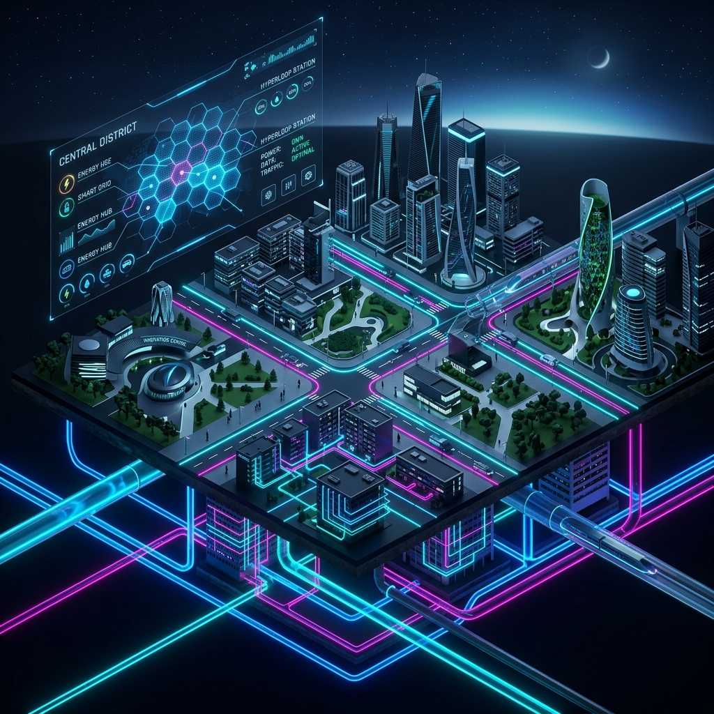
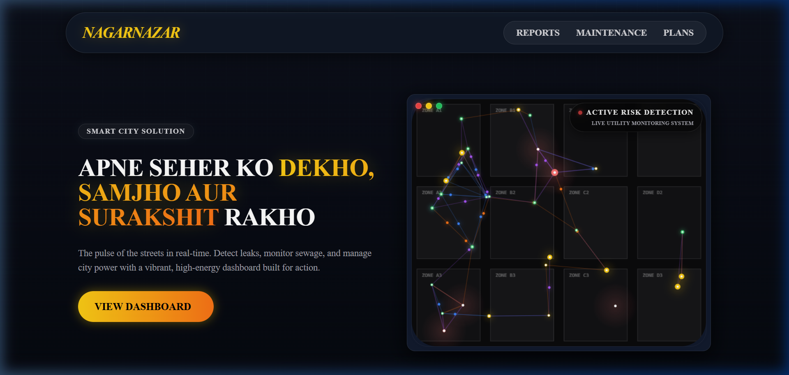
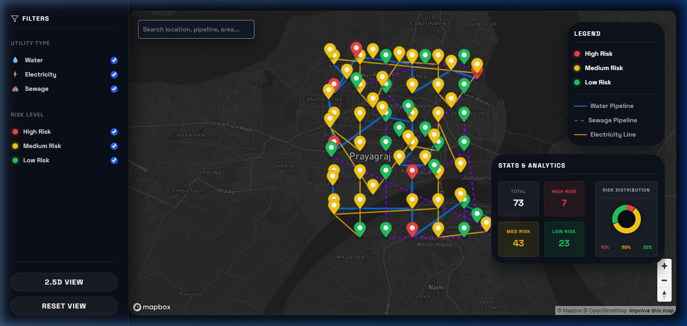

<p align="center">
  
</p>

<p align="center">
  <b>Turning scattered city utility data into visual insights, predictive alerts, and smarter infrastructure decisions.</b>
</p>

<div align="center">

[](https://nagar-nazar.vercel.app/)
[](https://github.com/akshatsharma09/NagarNazar)
[](https://github.com/akshatsharma09/NagarNazar)
[](https://github.com/akshatsharma09/NagarNazar/stargazers)

</div>

---

## 🌟 Overview

<p align="center">
  
</p>

**NagarNazar** is a cutting-edge smart city visualization platform developed during **HackDiwas 3.0**. It bridges the gap between raw infrastructure data and actionable urban intelligence.

By leveraging an interactive **2.5D Map Interface**, we empower city authorities to monitor, analyze, and predict the health of vital utility networks.

---

## ✨ Key Features

<table width="100%">
  <tr>
    <td width="50%">
      <h3>🗺️ 3D/2.5D Smart Mapping</h3>
      <p>Interactive utility visualization using Mapbox GL with tilted city views and building extrusions.</p>
    </td>
    <td width="50%">
      <h3>⚡ Multi-Layer Utility View</h3>
      <p>Seamlessly toggle between Water, Sewage, and Electricity infrastructure layers.</p>
    </td>
  </tr>
  <tr>
    <td width="50%">
      <h3>🚨 Intelligent Risk Detection</h3>
      <p>Real-time analysis categorizing infrastructure into Low, Medium, and High-risk zones.</p>
    </td>
    <td width="50%">
      <h3>🧠 Predictive Insights</h3>
      <p>Identify potential failure points before they occur using advanced data analytics.</p>
    </td>
  </tr>
  <tr>
    <td width="50%">
      <h3>📊 Analytics Dashboard</h3>
      <p>Comprehensive panels showing utility statistics, health metrics, and monitoring data.</p>
    </td>
    <td width="50%">
      <h3>📱 Responsive Design</h3>
      <p>A neo-brutalist UI optimized for both large monitoring screens and mobile devices.</p>
    </td>
  </tr>
</table>

---

## 🛠️ Technology Stack

<div align="center">
  
  
  
  
  
  
</div>

---

## 👥 Meet The Team

<div align="center">

| [<br /><sub><b>Namrah Arfin</b></sub>](https://github.com/NamrahArfin) | [<br /><sub><b>Abdul Samad</b></sub>](https://github.com/abdul-samad-001) | [<br /><sub><b>Akshat Sharma</b></sub>](https://github.com/akshatsharma09) | [<br /><sub><b>Shruti Mishra</b></sub>](https://github.com/ShrutiMishra30) |
| :---: | :---: | :---: | :---: |
| Designer, Strategist & Documentation | Frontend & UI/UX Developer | Backend Developer | Project Support |

</div>

---

## 🚀 Quick Start

### 1️⃣ Clone & Navigate
```bash
git clone https://github.com/akshatsharma09/NagarNazar.git
cd NagarNazar
```

### 2️⃣ Launch Frontend
```bash
cd frontend
npm install
npm start
```

### 3️⃣ Launch Backend
```bash
cd backend
pip install -r requirements.txt
python app.py
```

---

## 📸 System Snapshots

<p align="center">
  
  
</p>

### 🏙️ Landing Page


### 📊 Intelligence Dashboard


> **Note:** For a full interactive experience, visit our [Live Demo](https://nagar-nazar.vercel.app/).

---

## 🔮 Future Roadmap

- [ ] **IoT Integration:** Connecting real-time sensors to the utility layers.
- [ ] **AI Failure Prediction:** Using ML models for more accurate risk forecasting.
- [ ] **Mobile App:** Dedicated Android/iOS application for field workers.
- [ ] **Public Reporting:** Allowing citizens to report utility issues directly.

---

<div align="center">

### Built with ❤️ during HackDiwas 3.0

[](https://github.com/akshatsharma09/NagarNazar)

</div>

